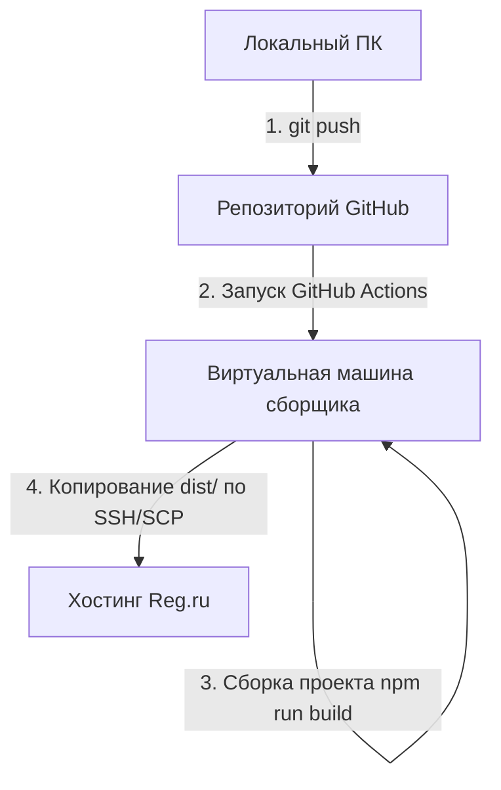

# Документация по автодеплою noblefarm.ru

Этот проект настроен для автоматической сборки и публикации на виртуальный хостинг Reg.ru при каждой отправке (push) изменений в репозиторий GitHub.

---

## Архитектура связи локальной машины, GitHub и хостинга



### 1. Связь с хостингом
* **Адрес сервера (Host):** `server66.hosting.reg.ru`
* **Пользователь хостинга (User):** `u0124240`
* **Каталог сайта на хостинге:** `/var/www/u0124240/data/www/noblefarm.ru`
* **Протокол передачи:** SSH/SCP (Порт 22).

### 2. Безопасность и авторизация
* На хостинге Reg.ru отключена авторизация по паролю для SSH.
* Авторизация происходит с помощью **SSH-ключей**:
  * **Приватный ключ** добавлен в секреты репозитория GitHub под именем `SSH_PRIVATE_KEY`.
  * **Публичный ключ** прописан на сервере хостинга в файле `~/.ssh/authorized_keys` пользователя `u0124240`.
  * Пользователь хостинга сохранен в секретах GitHub как `HOSTING_USER`.

---

## Как устроен сценарий деплоя (GitHub Actions)

Сценарий находится в файле [deploy.yml](file:///.github/workflows/deploy.yml). Он запускается автоматически при любом пуше в ветку `main`.

### Этапы работы сценария:
1. **Получение кода (Checkout):** Стягивает последний код репозитория.
2. **Настройка Node.js:** Устанавливает окружение Node.js 20.
3. **Установка зависимостей:** Выполняет команду `npm ci` для быстрой и чистой установки пакетов.
4. **Сборка проекта:** Запускает команду `npm run build`, которая генерирует готовую статическую сборку в папку `dist/`.
5. **Публикация (SCP):** 
   * Подключается к серверу `server66.hosting.reg.ru` по SSH с использованием приватного ключа.
   * Удаляет старые файлы в папке `/var/www/u0124240/data/www/noblefarm.ru` (кроме системных).
   * Загружает содержимое папки `dist/` на сервер.

---

## Инструкция: Как вносить правки

1. Внесите изменения в исходный код сайта локально в этой папке.
2. Откройте терминал и выполните три команды для отправки кода на GitHub:
   ```bash
   git add .
   git commit -m "Описание внесенных изменений"
   git push origin main
   ```
3. Отслеживать процесс сборки и публикации можно на странице репозитория во вкладке **Actions**:
   `https://github.com/Nikitaa2333333/noblefarm.ru/actions`
